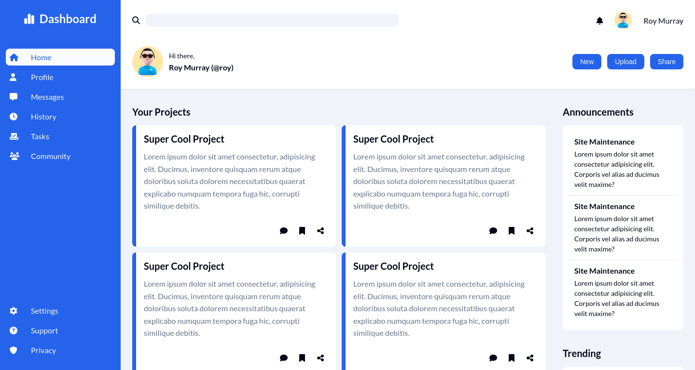

# odin-admin-dashboard

A responsive admin dashboard project built as part of [The Odin Project](https://www.theodinproject.com/) curriculum.

## [🖥️ Live Demo](https://issakass.github.io/odin-admin-dashboard/)

## 🚀 Features

- Fully responsive layout
- Modern dashboard UI
- Sidebar navigation

## 🛠️ Built With

- HTML5
- CSS3 (Flexbox & CSS Grid)

## 💡 Future Improvements

- Improve UI/UX
- Improve accessibility (ARIA, keyboard nav)
